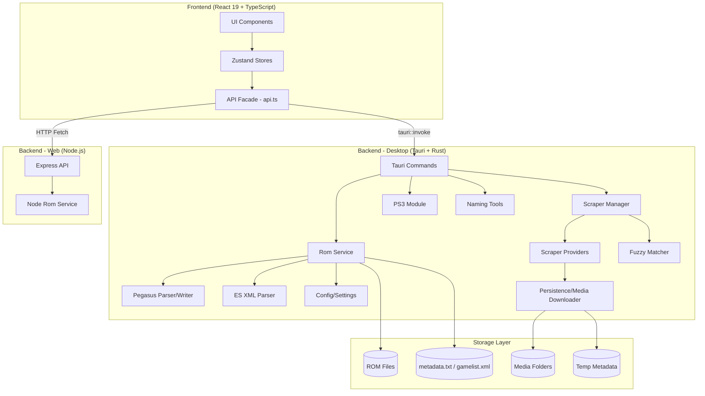

# ModernRetroManager - 现代化 Retro ROM 管理软件

## 📝 最近更新 (2026-01-21)

### 本次会话完成的功能

| 修复/优化项 | 文件 | 说明 |
|------------|------|------|
| **双数据源匹配** | `naming_check.rs`, `jy6d_dz.rs` | 集成 jy6d-dz 数据源作为 cn_repo 的补充，自动选择置信度更高的匹配结果 |
| **jy6d-dz CSV Reader** | `scraper/jy6d_dz.rs` | 新增 jy6d-dz 数据格式读取模块 |
| **系统映射扩展** | `system_mapping.rs` | 新增 `jy6d_csv_name` 字段支持 jy6d 数据源 |

### 之前完成的功能 (2026-01-20)

| 修复/优化项 | 文件 | 说明 |
|------------|------|------|
| **扫描结果去重** | `naming_check.rs` | 基于 `file` 字段 HashMap 去重，保留更完整的条目 |
| **Pegasus 模块统一** | `pegasus.rs`, `persistence.rs`, `naming_check.rs` | 将分散的 Pegasus metadata 生成逻辑统一到 `pegasus.rs` |
| **增强 Pegasus 导出** | `pegasus.rs` | 新增 `PegasusExportOptions`、`write_pegasus_file()` 支持合并模式 |
| **匹配英文名优化** | `naming_check.rs` | 不再重复扫描文件夹，直接读取临时 metadata |
| **移除无用弹窗** | `CnRomTools.tsx` | 移除匹配英文名的确认弹窗和完成提示 |
| **统一游戏名提取** | `naming_check.rs` | 合并 `parse_cn_name_from_filename` 和 `clean_folder_name` 为 `extract_game_name` |
| **查询名优先级** | `naming_check.rs` | 匹配时优先使用已生成的 `name` 字段，而非重新提取 |

### 架构改进

#### Pegasus Metadata 模块统一化
```
scraper/pegasus.rs (唯一入口)
├── PegasusExportOptions     # 导出配置（collection header、assets 等）
├── export_to_pegasus()      # 生成 metadata 字符串
├── write_pegasus_file()     # 文件写入 + 合并逻辑
├── write_multiline_field()  # 多行值处理（符合官方规范）
└── write_asset_field()      # 资源路径字段

调用方:
├── persistence.rs::save_metadata_pegasus()  # 使用新模块
└── naming_check.rs::export_pegasus_format() # 使用新模块
```

#### 游戏名提取逻辑统一化
```rust
extract_game_name(name: &str, is_filename: bool) -> Option<String>
// - 子文件夹 ROM → 从文件夹名提取 (is_filename=false)
// - 平台文件夹 ROM → 从文件名提取 (is_filename=true)
// - 统一清理：括号、汉化组、版本号、全角字符
```

---

## 🎯 项目愿景

打造一款**现代化、跨平台、开源**的 Retro ROM 管理软件，替代老旧的 ARRM 和 Skraper，摆脱对 screenscraper.fr 的过度依赖。

### 核心目标
- 🌐 **双模式部署**：可 Self-host 也可打包成 Native App (Win/Mac/Linux)
- 🎨 **现代化 UI**：使用最新前端技术，美观且高效 (Cyberpunk 风格)
- 🔌 **多源 Scraping**：整合多个 API 和爬虫源
- 📦 **兼容性强**：支持导入现有 metadata.txt、playlist.xml 等格式

---

## 🏗️ 技术架构与调用关系

### 1. 核心架构图



### 2. 调用关系说明

1.  **用户交互流**：用户在 UI（如 `RomView.tsx`）触发操作 → 调用 `romStore.ts` 中的 actions → 调用 `api.ts` 中的封装函数 → 进入后端处理。
2.  **数据获取流**：后端 `rom_service.rs` 扫描目录，应用 `config/temp` 中的临时元数据（优先级最高），然后读取库目录下的 `metadata.txt` 或 `gamelist.xml`，最后返回给前端。
3.  **Scraper 流**：`ScraperManager` 并行启动多个 Provider（SteamGridDB, ScreenScraper）进行搜索 → 聚合结果 → 生成置信度评分 → 用户确认后调用 `persistence.rs` 保存元数据到临时目录，并异步下载媒体文件。
4.  **中文整理流**：`naming_check.rs` 读取本地 `rom-name-cn` CSV 数据库 → 快速模糊匹配 (Fast Match) → 将匹配结果（英文名、置信度）写入临时元数据，不破坏原始 ROM 命名。

---

## 📚 代码库详解 (Function Reference)

### 1. Tauri 命令入口 (`src-tauri/src/commands/`)

这是前端与后端通信的桥梁。

- **ROM 管理 (`rom.rs`)**:
  - `get_roms`: 获取所有配置库的 ROM 列表（核心入口）。
  - `get_rom_stats`: 获取 ROM 统计信息（总数、系统数）。
  - `get_roms_for_single_directory`: 获取特定库目录的 ROM。
- **目录管理 (`directory.rs`)**:
  - `add_directory`: 添加新的扫描目录。
  - `get_directories`: 获取已配置的目录列表。
  - `remove_directory`: 移除目录。
  - `scan_directory`: 扫描目录并返回原始文件列表。
- **配置与设置 (`config.rs`)**:
  - `get_app_settings / save_app_settings`: 应用通用设置（语言、主题、API Key）。
  - `get_scraper_configs / save_scraper_config`: 各个 Scraper 源的详细配置。
  - `validate_path`: 后端验证路径合法性。
- **抓取器 API (`scraper.rs`)**:
  - `scraper_search`: 并行搜索多个源。
  - `scraper_auto_scrape`: 自动匹配并聚合数据。
  - `apply_scraped_data`: 将抓取的数据保存为临时元数据。
  - `save_temp_metadata`: 手动编辑后保存临时数据。
- **中文命名工具 (`naming_check.rs`)**:
  - `scan_directory_for_naming_check`: 核心扫描函数，识别子文件夹 ROM。
  - `auto_fix_naming`: 一键自动匹配中文/英文名（支持双数据源：cn_repo + jy6d-dz）。
  - `update_english_name`: 用户手动修正英文名。
- **jy6d-dz 数据源 (`scraper/jy6d_dz.rs`)**:
  - `load_jy6d_csv`: 加载 jy6d-dz 格式的中英文对照 CSV。
  - `Jy6dDzEntry`: 数据结构，包含 english_name, chinese_name, source_id, extra_json。
- **PS3 工具 (`ps3.rs`)**:
  - `generate_ps3_boxart`: 为 PS3 游戏合成封面（封面图+图标）。

### 2. 核心业务逻辑 (`src-tauri/src/rom_service.rs`)

- `get_all_roms / get_roms_for_directory`: 协调扫描、解析和元数据应用的高层函数。
- `scan_rom_files`: 无 metadata 时，根据系统后缀过滤扫描文件。
- `apply_temp_metadata`: **关键函数**。将 `config/temp` 下的临时数据合并到 ROM 信息中，实现非破坏性编辑。
- `try_load_from_temp_metadata`: 性能优化，直接从生成的临时 metadata 读取，跳过文件系统扫描。
- `detect_metadata_format`: 自动识别 Pegasus (`metadata.txt`) 或 EmulationStation (`gamelist.xml`)。
- `scan_media_directory`: 在没有 metadata 定义路径时，自动猜测 `media` / `images` 文件夹下的资源。

### 3. 解析器与持久化 (`src-tauri/src/scraper/`)

- **Pegasus 解析 (`pegasus.rs`)**:
  - `parse_pegasus_file / parse_pegasus_content`: 实现完整的 Pegasus 规范解析，支持多行备注和自动编码检测 (UTF-8/GBK)。
  - `write_pegasus_file / export_to_pegasus`: 序列化游戏信息回文件，支持 Merge 模式（保留未修改字段）。
- **调度管理 (`manager.rs`)**:
  - `ScraperManager::scrape`: 核心调度逻辑，实现 Hash 查找、名称搜索和多源数据聚合。
  - `aggregate_metadata`: 将不同来源（如 IGDB 的描述 + SteamGridDB 的封面）按优先级合并。
- **持久化 (`persistence.rs`)**:
  - `save_metadata_pegasus / save_metadata_emulationstation`: 统一保存接口。
  - `download_media`: 处理并发图片下载、路径规范化和增量更新。

### 4. PS3 模块 (`src-tauri/src/ps3/`)

- `sfo.rs`: `PARAM.SFO` 解析器，支持从目录或 ISO（ISO9660 提取）获取游戏名和 ID。
- `boxart.rs`: 使用 `image` crate 进行图像合成，将 `PIC1.PNG` 作为背景，`ICON0.PNG` 作为图标合成专属预览图。
- `iso.rs`: 底层 ISO 文件系统解析，用于提取镜像内的资源。

### 5. 前端 Store 与 API (`src/stores/`, `src/lib/api.ts`)

- `romStore.ts`: 管理全局 ROM 数据流，控制扫描进度。
- `scraperStore.ts`: 管理 Scraper 状态、优先级和搜索结果。
- `api.ts`: **适配器层**。封装了 Tauri `invoke` 和 Web 端的 `fetch` 调用，实现环境自动感知。
- `image.ts`: 媒体资源 URL 的统一解析，处理 `convertFileSrc` 与 Web 加密 URL。

---


---

### 1. ROM 库管理
- [x] 目录递归扫描
- [x] 多 metadata 格式支持 (Pegasus / ES)
- [x] 临时元数据覆盖机制 (Non-destructive editing)
- [x] PS3 专用支持 (SFO 解析, 混合目录)

### 2. Scraper
- [x] 多源聚合 (Manager 模式)
- [x] SteamGridDB 实现
- [x] ScreenScraper 实现
- [x] 并行搜索与下载
- [x] 优先级配置

### 3. 中文 ROM 整理
- [x] CSV 数据库集成 (rom-name-cn)
- [x] 双数据源支持 (cn_repo + jy6d-dz)
- [x] 智能命名提取 (去除标签/版本号)
- [x] 批量自动匹配
- [x] 结果导出 (Pegasus / Gamelist)
- [x] 手动修正与锁定 (Confidence=100)

### 4. UI/UX
- [x] 虚拟列表 (React Window)
- [x] 拖拽调整列宽
- [x] 进度条反馈
- [x] 国际化 (i18n)

---

---

## 🚀 开发路线图

### Phase 1: 基础框架 (MVP) - [x] 已完成
- [x] Tauri v2 + React 19 + TypeScript 项目搭建
- [x] TailwindCSS v4 + 8 种主题配置
- [x] Metadata 解析系统 (Pegasus / ES)
- [x] 18 种游戏系统预设与图标映射
- [x] 现代化单页 UI (Grid/List/Spotlight Search)

### Phase 2: Scraper 核心 - [/] 进行中
- [x] ScraperManager 统一调度层
- [x] Standardized Data Models (GameMetadata, MediaAsset)
- [x] SteamGridDB & ScreenScraper 集成
- [x] 多源数据智能聚合 (Priority-based Merge)
- [x] Hash 精确匹配 (CRC32/MD5/SHA1)
- [x] 并行媒体下载与本地缓存
- [ ] 批量 Scrape 任务队列与进度反馈 (Coming soon)
- [ ] 更多 Provider 集成 (IGDB, MobyGames)

### Phase 3: 中文 ROM 专场 - [x] 已完成
- [x] `rom-name-cn` 本地数据库集成
- [x] 智能文件名提取与清洗 (版本号/标签过滤)
- [x] 目录结构识别 (子文件夹 ROM 支持)
- [x] 自动重命名/对照一键修复
- [x] 整理进度持久化 (Temp Metadata)

### Phase 4: PS3 专场 - [x] 已完成
- [x] PARAM.SFO 与 ISO 镜像解析
- [x] 封面预览图自动合成引擎
- [x] 混合目录扫描支持

### Phase 5: 临时元数据架构 (Temp Metadata) - [x] 已完成
- [x] 统一样式：不修改原始 ROM 目录，所有修改存入 `config/temp`
- [x] 多库隔离机制 (Path Normalization)
- [x] 手动编辑实时保存与前端覆盖显示
- [x] 媒体 URL 解析与预加载系统

### Phase 6: 部署与 Web 版本 - [/] 进行中
- [x] 环境变量覆盖配置 (`CONFIG_DIR`)
- [x] Node.js Express 后端实现
- [x] Docker 多阶段构建与 Compose 配置
- [x] 前端 Web 模式 API 自动切换
- [ ] 用户权限管理 (Web 版专用)
- [ ] 在线导出与 ZIP 打包下载

---

## 🔗 参考资源

### API 文档
- [SteamGridDB API](https://www.steamgriddb.com/api/v2)
- [ScreenScraper API](https://www.screenscraper.fr/webapi2.php)
- [Pegasus Meta-files](https://pegasus-frontend.org/docs/user-guide/meta-files/)

### 技术框架
- [Tauri](https://tauri.app/)
- [React](https://react.dev/)
- [TailwindCSS](https://tailwindcss.com/)
- [Express](https://expressjs.com/)
- [Docker](https://www.docker.com/)

---
